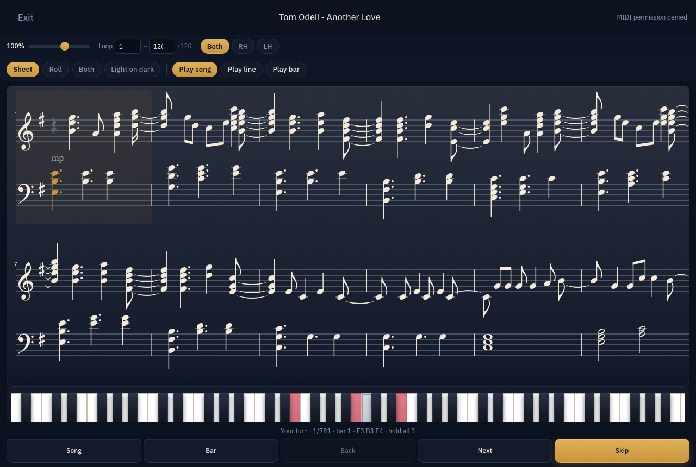
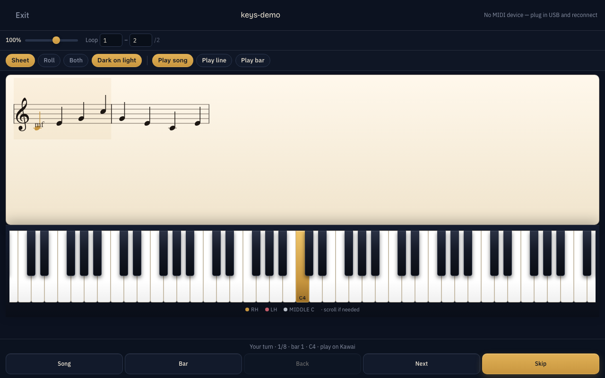
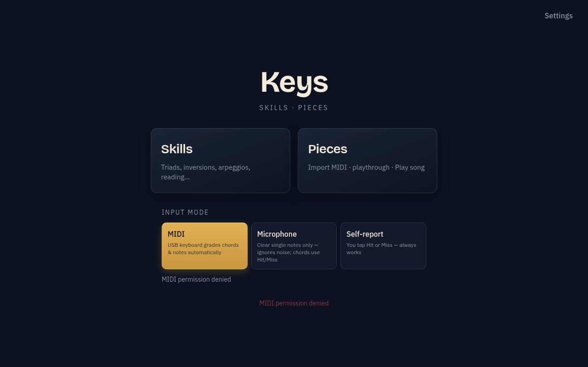
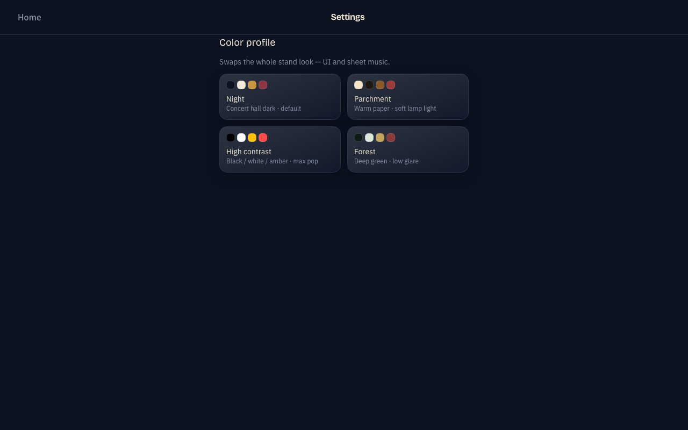
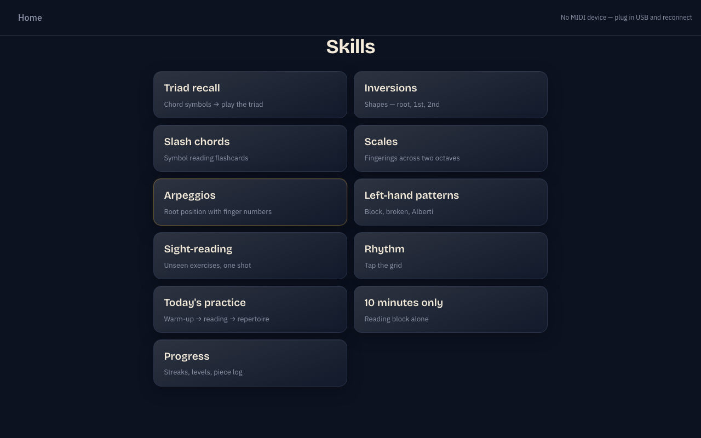

# Keys

A music-stand piano practice app focused on **MIDI playthrough**: import a piece, read real sheet music, and play along on a USB keyboard with live grading and demo playback.



## Highly recommended: USB-MIDI piano

Keys is built around a **real piano / digital keyboard over USB-MIDI** (for example a Kawai with USB-B). That is the intended way to use playthrough and Skills drills.

1. Connect the keyboard to your computer with a USB cable.
2. Open Keys in **Chrome** (Web MIDI).
3. On Home, choose **MIDI**.
4. Play — held notes are graded automatically.

Self-report (Hit / Miss) exists as a fallback when no keyboard is available, but playthrough and practice feel much better with MIDI connected.

## Playthrough

1. Open **Pieces** → **Import MIDI** (`.mid` / `.midi`).
2. The piece opens in walk-through / playthrough with:
   - VexFlow **sheet music** (and optional piano roll)
   - Full on-screen **88-key** piano with RH / LH colors
   - **Play song / Play line / Play bar**, plus Pause / Resume / Stop
   - Measure navigation (buttons, arrows, scroll)
   - **Light on dark ↔ Dark on light** sheet invert
3. Play the current step on your MIDI keyboard (or listen with Play song).

Imported pieces stay in this browser’s IndexedDB on your machine — they are not uploaded anywhere.

| Sheet (light on dark) | Sheet (dark on light) |
| --- | --- |
|  |  |

## Also included

- **Skills** — triad recall, inversions, scales/arpeggios, reading drills, and more  
- **Color profiles** — Night, Parchment, High contrast, Forest (Settings)

| Home | Settings |
| --- | --- |
|  |  |



## Requirements

- Node.js 20+ (or current LTS)
- **Google Chrome** (Web MIDI)
- USB-MIDI keyboard strongly recommended

## Install & run

```bash
git clone https://github.com/Jak-Kolb/piano_trainer.git
cd piano_trainer
npm install
npm start
```

Opens **http://127.0.0.1:5173/** — use Chrome.

```bash
npm run dev    # hot reload
npm test       # unit tests
npm run build  # production build
```

macOS: after `npm install`, you can double-click `scripts/Keys.command`.

## Stack

Vite · React · TypeScript · Tailwind · VexFlow · Tone.js · `@tonejs/midi`

## Desktop app (this branch)

Keys can also run as a native **Electron** window (same UI, Web MIDI enabled in-app).

```bash
npm install
npm run electron:dev      # Vite + Electron window
npm run electron:pack     # build macOS app into release/mac*/
```

Browser `npm start` still works. Prefer the desktop build when you want an app icon / window instead of a Chrome tab.

