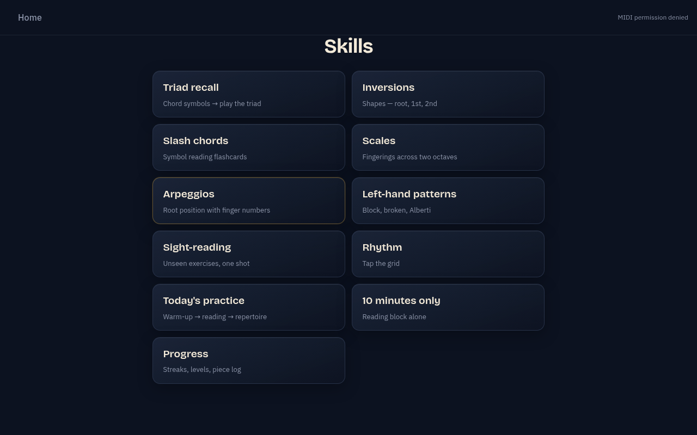
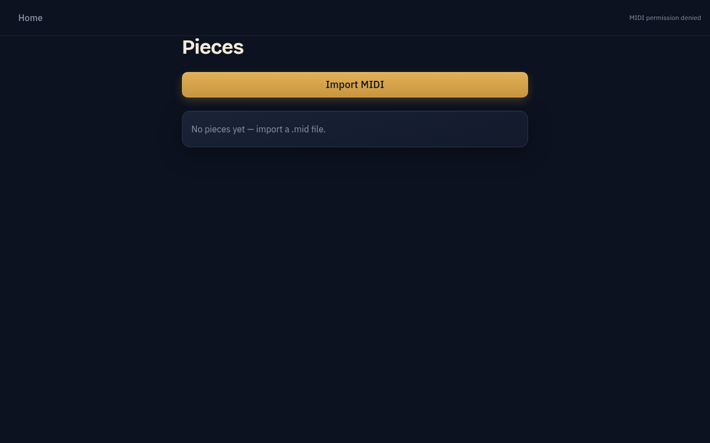
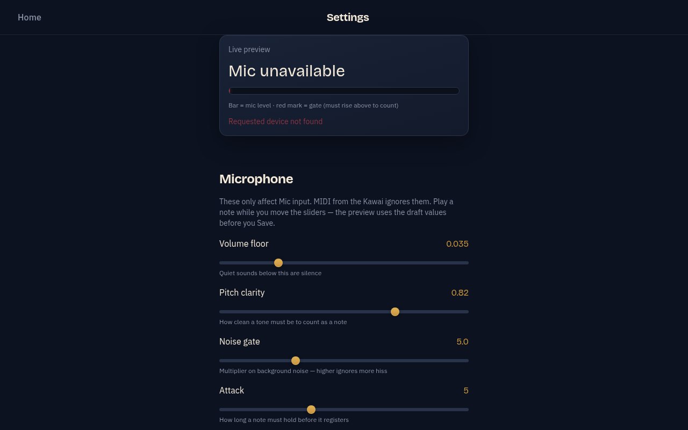
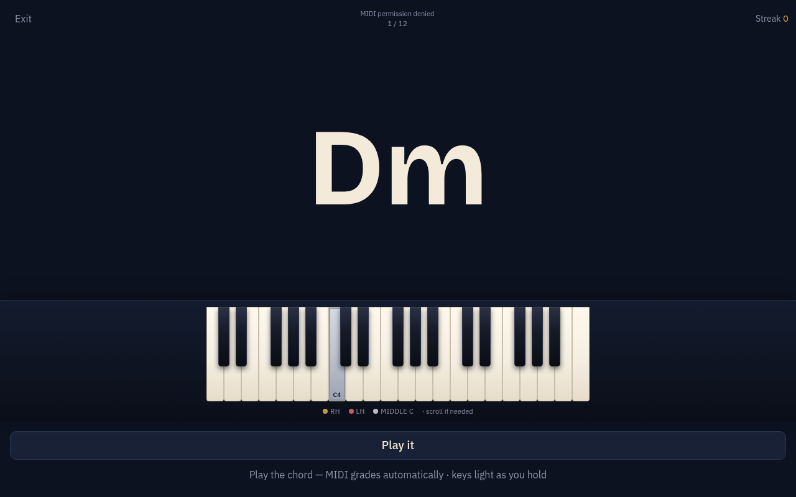
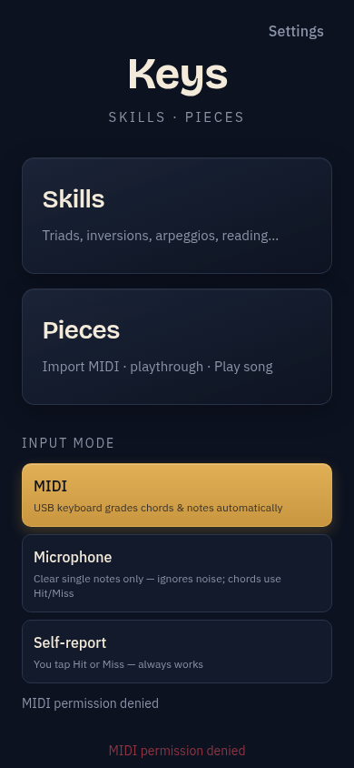

# Keys

Offline piano practice app for a music stand: **Skills** drills and **Pieces** playthrough with real sheet music. Built for a Kawai (or any USB-MIDI keyboard) in Chrome.


## Features

- **Skills** — triad recall, inversions, scales/arpeggios, slash chords, sight-reading, rhythm, and more
- **Pieces** — import MIDI, walk through with VexFlow sheet + on-screen 88-key piano
- **Playthrough** — Play song / line / bar, pause & resume, measure navigation, sheet invert (light-on-dark ↔ dark-on-light)
- **Input** — USB-MIDI auto-grade, or self-report Hit/Miss
- **Color profiles** — Night, Parchment, High contrast, Forest (Settings)

## Screenshots

| Home | Skills |
| --- | --- |
|  |  |

| Pieces library | Settings |
| --- | --- |
|  |  |

| Drill | Home (narrow) |
| --- | --- |
|  |  |

## Requirements

- **Node.js** 20+ (or current LTS)
- **Chrome** (Web MIDI). Safari is not supported for MIDI.
- Optional: USB-MIDI keyboard (e.g. Kawai KDP110 via USB-B)

## Install

```bash
git clone https://github.com/Jak-Kolb/piano_trainer.git
cd piano_trainer
npm install
```

## Run

Production-style local preview (recommended):

```bash
npm start
```

Opens **http://127.0.0.1:5173/** in Chrome.

Dev server with hot reload:

```bash
npm run dev
```

**macOS one-click:** after `npm install`, double-click `scripts/Keys.command` (or copy it to your Desktop).

## Using the app

1. On Home, pick **MIDI** (plug in the keyboard first) or **Self-report**.
2. **Skills** — choose a drill and play (or tap Hit/Miss).
3. **Pieces** — Import MIDI → open a piece → playthrough sheet.
4. Toolbar: **Sheet / Roll / Both**, **Light on dark ↔ Dark on light**, Play song / line / bar, Pause / Resume / Stop.
5. **Settings** — switch color profile (applies live).

Imported pieces are stored in the browser (IndexedDB) on this machine.

## Test & build

```bash
npm test
npm run build
```

## Stack

Vite · React · TypeScript · Tailwind v4 · VexFlow · Tone.js · `@tonejs/midi`

Spec notes live in `piano_trainer_spec.md` and `docs/`.

## License

Private / personal project unless otherwise noted.
