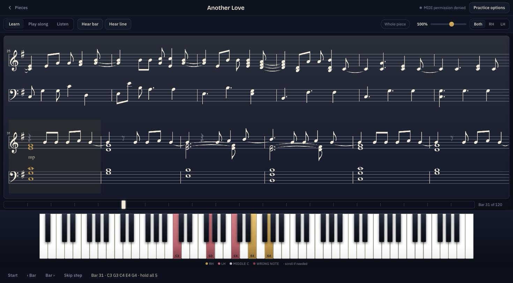
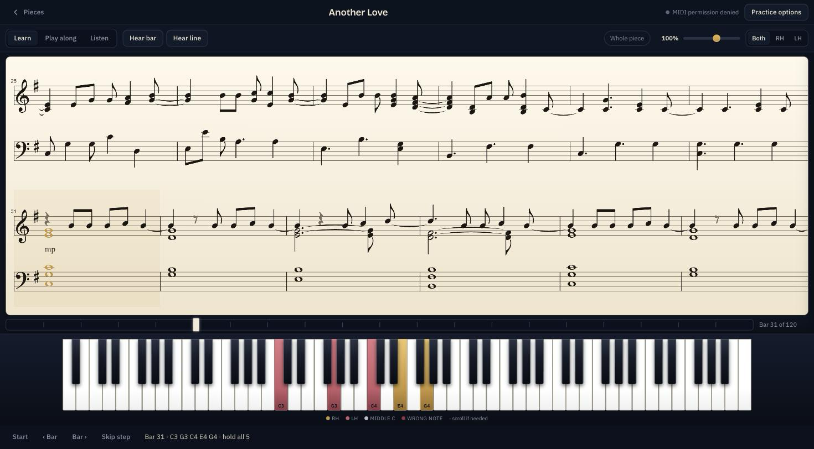
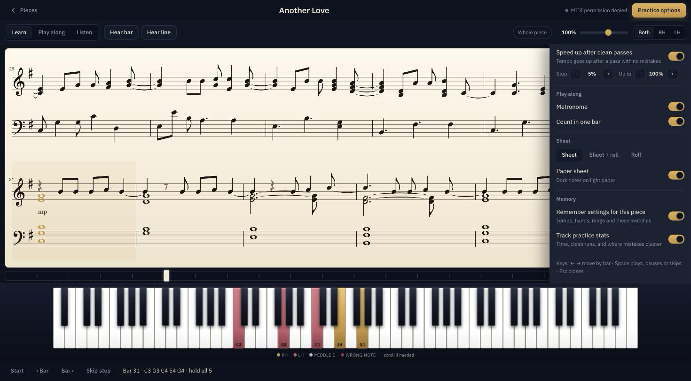
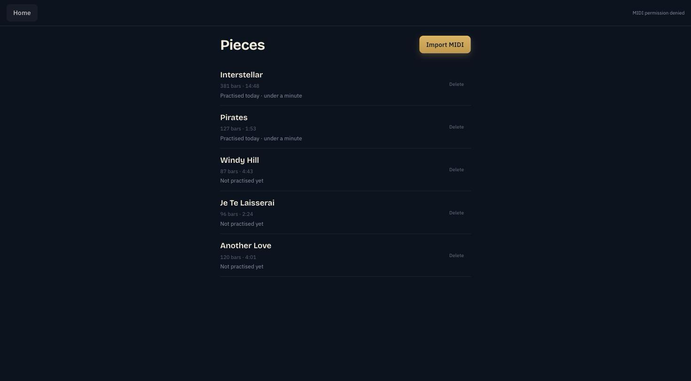
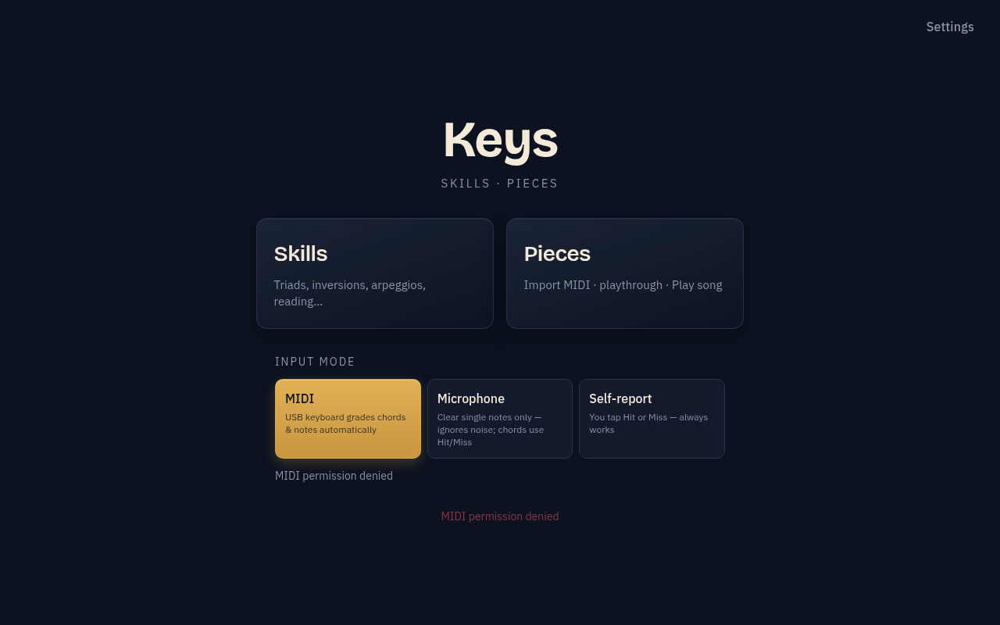
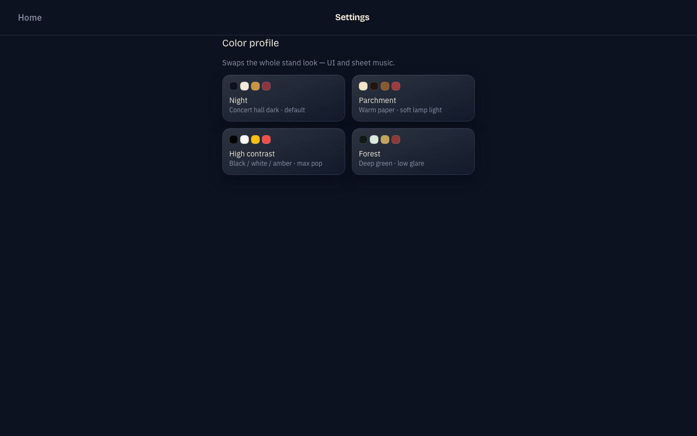
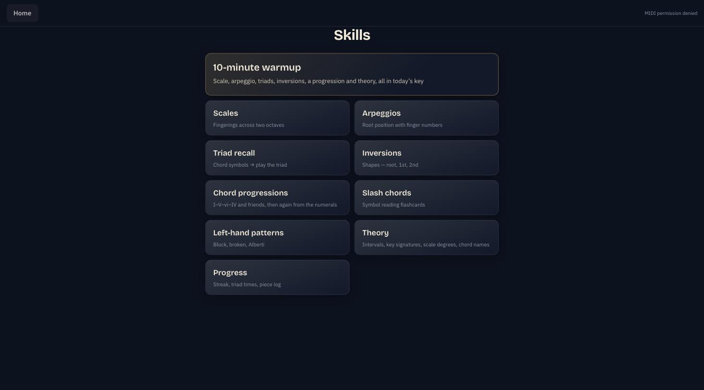

# Keys

A music-stand piano practice app focused on **MIDI playthrough**: import a piece, read real sheet music, and practise it on a USB keyboard. Learn it step by step, play along in time with grading, or listen to it.



## Highly recommended: USB-MIDI piano

Keys is built around a **real piano / digital keyboard over USB-MIDI** (for example a Kawai with USB-B). That is the intended way to use playthrough and Skills drills.

1. Connect the keyboard to your computer with a USB cable.
2. Open Keys in **Chrome** (Web MIDI).
3. On Home, choose **MIDI**.
4. Play: held notes are graded automatically.

Self-report (Hit / Miss) exists as a fallback when no keyboard is available, but playthrough and practice feel much better with MIDI connected.

## Practising a piece

1. Open **Pieces** → **Import MIDI** (`.mid` / `.midi`).
2. Pick a mode:
   - **Learn** waits for you to play each step on your keyboard. You can hear a bar or a line first.
   - **Play along** keeps time with a metronome and a one-bar count-in. It grades every note as on time, early, late, missed or wrong, colours the noteheads, and ends with a results card.
   - **Listen** plays the piece, a bar or a line, with the sustain pedal.
3. Choose **RH / LH / Both** and the tempo. Drag on the **bar strip** under the sheet (or shift-click bars) to practise part of the piece. Click it to jump. **← →** move by bar, and **Space** plays, pauses or skips.

**Practice options** (top right) are switches, saved with each piece:

| Switch | What it does |
| --- | --- |
| Play the other hand for me | While you practise one hand, the app plays the other (after each step in Learn, in time in Play along) |
| Show my keys and wrong notes | Your held keys light up on the on-screen piano; wrong notes turn red |
| Repeat the range / Speed up after clean passes | Loop the range, raising the tempo a step after each pass with no mistakes |
| Metronome / Count in one bar | For Play along |
| Remember settings for this piece | Tempo, hands, range and these switches |
| Track practice stats | Time practised, clean runs, best tempo, and where mistakes cluster (tinted on the bar strip) |

The sheet music is engraved from the MIDI file:
- 6/8 and cut time are written correctly.
- Triplets and sextuplets are detected.
- Held notes move to a second voice.
- Key and time signature changes are drawn, and minor keys are spelled correctly.
- A hand that sits far outside its clef switches clef for that line.
- Each line holds as many bars as fit.

The **Pieces** list shows how practice is going, including the date of your first clean play-through of each piece.

Imported pieces and practice history stay in this browser's IndexedDB on your machine. They are not uploaded anywhere.

| Sheet (light on dark) | Sheet (dark on light) |
| --- | --- |
|  |  |

| Practice options | Pieces |
| --- | --- |
|  |  |

## Also included

- **Skills**
  - A **10-minute warmup** in a key that changes each day:
    1. a scale and an arpeggio with fingering;
    2. triads;
    3. inversions;
    4. a chord progression, played once with names and once from the numerals;
    5. quick theory questions (intervals, key signatures, scale degrees, chord names).
  - Each of these is also a drill on its own, alongside slash chords and left-hand patterns.
  - With a MIDI keyboard everything is graded as you play.
- **Color profiles** — Night, Parchment, High contrast, Forest (Settings)

| Home | Settings |
| --- | --- |
|  |  |



## Requirements

- Node.js 20+ (or current LTS)
- **Google Chrome** (Web MIDI)
- USB-MIDI keyboard strongly recommended

## Install & run

```bash
git clone https://github.com/Jak-Kolb/piano_trainer.git
cd piano_trainer
npm install
npm start
```

Opens **http://127.0.0.1:5173/** — use Chrome.

```bash
npm run dev    # hot reload
npm test       # unit tests
npm run build  # production build
```

macOS: after `npm install`, you can double-click `scripts/Keys.command`.

## Stack

Vite · React · TypeScript · Tailwind · VexFlow · Tone.js · `@tonejs/midi`
